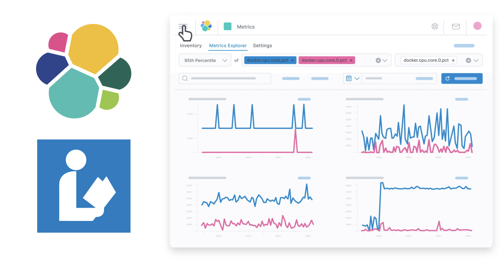

# Elastic Library Analytics



Apollo by Biblionix is a popular Integrated Library System (ILS) for public libraries.  This script extracts the high-level data from an export of that system.  An administrator would download an export from Apollo, then run this script to extract the high-level relationships in the data, which will exclude any personal information (e.g., patron names, phone numbers, addresses, etc.). Once this script is run, several files will be written that contain the data necessary to view circulation behavior.  That data is then loaded into Elastic to search and analyze it.

Based on the various [XML elements](ldif_038.xsd) that Apollo uses, we build equivalent JSON documents in Elasticsearch.  They are, with their corresponding Xpath & JSON export file, as follows:

| Data Source | Apollo XML | Elastic JSON |
| ----------- | ----------- | ----------- |
| Biblios | //biblio | data/biblios.json |
| Patrons | //patron | data/patrons.json |
| Addresses | //address | data/addresses.json |
| Fines | //fine | data/fines.json |
| Reserves | //reserve | data/reserves.json |
| Holdings | //holding | data/holdings.json |
| Checkouts | //checkout | data/checkouts.json |

Run the extractor.rb script as follows:

```
$ ruby extractor.rb -f my-apollo-export.ldif
Reading export ... done

Extracting //biblio to data/biblios.json ... done
Extracting //patron to data/patrons.json ... done
Extracting //address to data/addresses.json ... done
Extracting //fine to data/fines.json ... done
Extracting //reserve to data/reserves.json ... done
Extracting //holding to data/holdings.json ... done
Extracted //checkout to data/checkouts.json ... done

Completed in 2 min 40 sec
```

The output should yield:

```
$ ls data/
addresses.json	checkouts.json	holdings.json	reserves.json
biblios.json	fines.json	patrons.json
```

Before importing, edit the `.env` file to set your Elastic cluster information:

```
$ vi .env
```

Source the `.env` in your shell:

```
$ . .env
```

You can then import these models into Elastic with the following script:

```
$ ./load.rb 

Error: missing required option `-n', `--name'

usage: ./load.rb [options]
    -n, --name     Data set
    -c, --create   Create index
    -i, --index    Load index
    -d, --delete   Delete index
    -r, --reindex  Reindex
    -s, --status   Cluster status
$ ./load.rb -n checkouts -s

Getting cluster status ... green
Took 0.1330 ms

```

Then run an index for one of the data models:


```
$ ./load.rb -n checkouts -r
Deleting index for patrons ...
Creating index for patrons ...
Importing patrons in batches of 100 ...
[################################################] [47/47] [100.00%] [00:07] [00:00] [ 6.02/s]
Getting cluster status ... green
Took 0.1170 ms

```

### Correlation Data

We also recommend pulling in historical weather data for the location of the library.  This can be helpful to correlate inclement weather with circulation behavior.  The [OpenWeather](https://home.openweathermap.org/marketplace) project provides 40 years of hourly weather conditions for a nominal feel.  See the [Weather]() repository for direction on importing weather into Elastic.